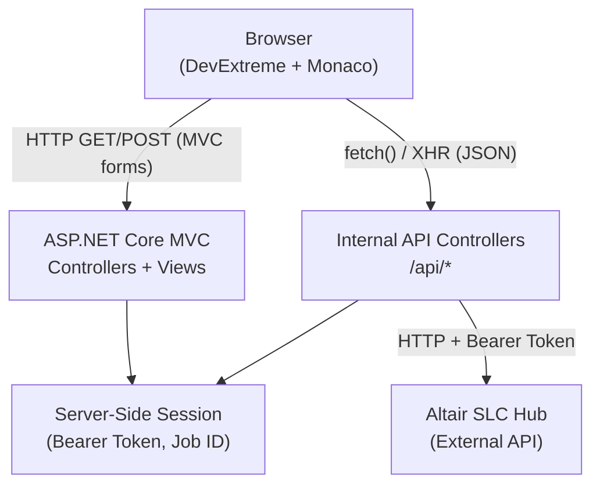

# Design Document: SAS Job Runner

## Overview

The SAS Job Runner is an ASP.NET Core MVC .NET 10 web application that acts as a thin, secure proxy between the user's browser and the Altair SLC Hub API. The application provides:

- A **Login screen** for credential-based authentication against the Altair SLC Hub.
- A **Configure Output screen** containing a Monaco code editor, Run/Cancel controls, and a live Log Tab.
- A set of **internal API controllers** (`/api/*`) that proxy all Altair SLC Hub calls server-side, keeping the Bearer Token out of the browser entirely.

The UI is built exclusively with DevExtreme components (buttons, tabs, layout containers) and the Monaco Editor for code authoring. Client-side polling drives live job status and log updates at a 5-second interval while a job is active.

### Key Design Decisions

| Decision | Rationale |
|---|---|
| Bearer Token stored in server-side Session only | Prevents token leakage via browser DevTools, XSS, or network inspection |
| Internal API controllers as proxy layer | Single responsibility: MVC views own UI, API controllers own Altair SLC Hub communication |
| `IHttpClientFactory` with named client | Avoids socket exhaustion; per-request Authorization header set on `HttpRequestMessage`, not `DefaultRequestHeaders`, to prevent race conditions |
| Anti-forgery tokens on state-changing endpoints | Protects job submission and cancellation from CSRF attacks |
| Client-side `setInterval` polling | Simple, predictable; no WebSocket infrastructure required |
| 1 MB request size limit on job submission | Prevents oversized payloads from reaching the Altair SLC Hub |

---

## Architecture

### High-Level Component Diagram



### Request Flow Summary

1. **Login**: Browser POSTs credentials → `AccountController` → `AuthApiController` → Altair SLC Hub → token stored in Session → redirect to Configure Output.
2. **Run**: Browser POSTs SAS code + anti-forgery token → `JobApiController.Submit` → Altair SLC Hub → Job_ID returned to browser → polling starts.
3. **Poll**: Browser calls `JobApiController.Status` and `JobApiController.Log` every 5 seconds → API reads token from Session → forwards to Altair SLC Hub → returns JSON to browser.
4. **Cancel**: Browser POSTs Job_ID + anti-forgery token → `JobApiController.Cancel` → Altair SLC Hub → polling stops.

---

## Components and Interfaces

### Project Structure

```
SasJobRunner/
├── Controllers/
│   ├── AccountController.cs          # Login GET/POST, Logout
│   └── HomeController.cs             # Configure Output screen (authenticated)
├── Controllers/Api/
│   ├── AuthApiController.cs          # POST /api/auth/login
│   └── JobApiController.cs           # POST /api/jobs/submit
│                                     # DELETE /api/jobs/{jobId}/cancel
│                                     # GET /api/jobs/{jobId}/status
│                                     # GET /api/jobs/{jobId}/log
├── Models/
│   ├── LoginViewModel.cs
│   ├── ApiErrorResponse.cs
│   ├── JobSubmitRequest.cs
│   ├── JobSubmitResponse.cs
│   ├── JobStatusResponse.cs
│   └── JobLogResponse.cs
├── Services/
│   └── SlcHubClient.cs               # Typed HttpClient wrapper for Altair SLC Hub
├── Views/
│   ├── Account/
│   │   └── Login.cshtml
│   └── Home/
│       └── Index.cshtml              # Configure Output screen
├── wwwroot/
│   ├── js/
│   │   ├── login.js                  # Login form logic
│   │   └── configure-output.js      # Editor, polling, button state
│   └── css/
│       └── site.css
├── appsettings.json                  # SlcHub:BaseUrl, Session:TimeoutMinutes
└── Program.cs
```

### MVC Controllers

#### `AccountController`

| Action | Method | Route | Description |
|---|---|---|---|
| `Login` | GET | `/account/login` | Renders login view |
| `Login` | POST | `/account/login` | Validates form, calls `AuthApiController` internally, stores token, redirects |
| `Logout` | POST | `/account/logout` | Clears Session, redirects to login |

#### `HomeController`

| Action | Method | Route | Description |
|---|---|---|---|
| `Index` | GET | `/` | Renders Configure Output screen; `[Authorize]`-equivalent session check redirects to login if no token |

### Internal API Controllers

All API controllers inherit from `ControllerBase` and are decorated with `[ApiController]` and `[Route("api/[controller]")]`.

#### `AuthApiController` — `POST /api/auth/login`

- Accepts `{ username, password }` JSON body.
- Calls Altair SLC Hub `POST /auth/login`.
- On success: stores Bearer Token in `HttpContext.Session`, returns `200 OK` with `{ success: true }`.
- On 4xx from Hub: returns `400` with `ApiErrorResponse`.
- On timeout/network failure: returns `503` with `ApiErrorResponse`.

#### `JobApiController`

| Endpoint | Method | Anti-Forgery | Description |
|---|---|---|---|
| `/api/jobs/submit` | POST | ✅ Required | Submits SAS program; returns `{ jobId }` |
| `/api/jobs/{jobId}/cancel` | DELETE | ✅ Required | Cancels active job |
| `/api/jobs/{jobId}/status` | GET | ❌ Read-only | Returns `{ status }` |
| `/api/jobs/{jobId}/log` | GET | ❌ Read-only | Returns `{ log }` |

All endpoints:
- Return `401` with `ApiErrorResponse` if Session has no Bearer Token (checked before any Hub call).
- Return `503` with `ApiErrorResponse` on Hub timeout (30 s for submit/cancel, 10 s for status/log).
- Return `ApiErrorResponse` mirroring Hub error body on Hub 4xx/5xx.

`/api/jobs/submit` additionally:
- Returns `409` with `ApiErrorResponse` if a job with status `Submitted` or `Running` is already tracked in Session.
- Returns `413` with `ApiErrorResponse` if request body exceeds 1 MB.
- Validates anti-forgery token via `[ValidateAntiForgeryToken]`.

### `SlcHubClient` Service

A typed `HttpClient` wrapper registered via `AddHttpClient<SlcHubClient>`. The base URL is configured from `appsettings.json` (`SlcHub:BaseUrl`).

```csharp
public class SlcHubClient
{
    private readonly HttpClient _http;

    // Each method accepts the bearer token as a parameter and sets it
    // on the individual HttpRequestMessage — never on DefaultRequestHeaders.
    public Task<SlcLoginResult> LoginAsync(string username, string password, CancellationToken ct);
    public Task<string> SubmitJobAsync(string bearerToken, string sasCode, CancellationToken ct);
    public Task CancelJobAsync(string bearerToken, string jobId, CancellationToken ct);
    public Task<string> GetJobStatusAsync(string bearerToken, string jobId, CancellationToken ct);
    public Task<string> GetProgramLogAsync(string bearerToken, string jobId, CancellationToken ct);
}
```

### Session Keys

| Key | Type | Description |
|---|---|---|
| `"BearerToken"` | `string` | Altair SLC Hub Bearer Token |
| `"ActiveJobId"` | `string` | Job_ID of the currently active job (cleared on terminal state) |
| `"ActiveJobStatus"` | `string` | Last known status of the active job |

### Client-Side Module: `configure-output.js`

Responsibilities:
- Initialize Monaco Editor with SAS language registration.
- Manage DevExtreme button enabled/disabled state.
- Implement the 5-second polling loop (`setInterval` / `clearInterval`).
- Handle all `fetch()` calls to internal API endpoints.
- Update Log Tab content and auto-scroll.
- Read the anti-forgery token from the `<meta name="RequestVerificationToken">` tag injected by the Razor view.

---

## Data Models

### `LoginViewModel`

```csharp
public class LoginViewModel
{
    [Required] public string Username { get; set; } = "";
    [Required] public string Password { get; set; } = "";
    public string? ErrorMessage { get; set; }
}
```

### `ApiErrorResponse`

```csharp
public class ApiErrorResponse
{
    public int StatusCode { get; set; }
    public string Message { get; set; } = "";
}
```

### `JobSubmitRequest`

```csharp
public class JobSubmitRequest
{
    [Required] public string SasCode { get; set; } = "";
}
```

### `JobSubmitResponse`

```csharp
public class JobSubmitResponse
{
    public string JobId { get; set; } = "";
}
```

### `JobStatusResponse`

```csharp
public class JobStatusResponse
{
    public string Status { get; set; } = ""; // Submitted | Running | Completed | Failed | Cancelled
}
```

### `JobLogResponse`

```csharp
public class JobLogResponse
{
    public string Log { get; set; } = "";
}
```

### Altair SLC Hub API Contracts (External)

The following are the expected shapes of Altair SLC Hub responses, inferred from the requirements:

**POST `/auth/login`** → `{ "token": "<bearer_token>" }`

**POST `/jobs`** → `{ "jobId": "<job_id>" }`

**DELETE `/jobs/{jobId}`** → `204 No Content` or `200 OK`

**GET `/jobs/{jobId}/status`** → `{ "status": "Submitted" | "Running" | "Completed" | "Failed" | "Cancelled" }`

**GET `/jobs/{jobId}/log`** → `{ "log": "<program_log_text>" }`

### Client-Side State (JavaScript)

```javascript
const state = {
  jobId: null,           // string | null
  pollingInterval: null, // setInterval handle | null
  lastLog: "",           // last successfully retrieved log text
};
```

### UI Button State Machine

```mermaid
stateDiagram-v2
    [*] --> Idle: Page load
    Idle --> Running: Run clicked (job submitted)
    Running --> Idle: Completed / Failed / Cancelled / Error
    Running --> Cancelling: Cancel clicked
    Cancelling --> Idle: Cancel confirmed
    Cancelling --> Running: Cancel failed (continue polling)

    state Idle {
        RunButton: enabled
        CancelButton: disabled
    }
    state Running {
        RunButton: disabled
        CancelButton: enabled
    }
    state Cancelling {
        RunButton: disabled
        CancelButton: disabled
    }
```

---

## Correctness Properties

*A property is a characteristic or behavior that should hold true across all valid executions of a system — essentially, a formal statement about what the system should do. Properties serve as the bridge between human-readable specifications and machine-verifiable correctness guarantees.*


### Property 1: Bearer Token Storage Round-Trip

*For any* non-null, non-empty string returned as a Bearer Token by the Altair SLC Hub login API, the SAS Job Runner SHALL store that exact string in the server-side Session under the `"BearerToken"` key, such that reading `Session["BearerToken"]` after a successful login returns the same string that was received from the Hub.

**Validates: Requirements 1.3**

---

### Property 2: Unauthenticated Request Redirect

*For any* HTTP request to the Configure Output Screen (or any protected route) where the server-side Session does not contain a non-null, non-empty `"BearerToken"` value, the SAS Job Runner SHALL respond with a redirect to the login screen.

**Validates: Requirements 1.6, 1.8**

---

### Property 3: Bearer Token Forwarding

*For any* API call made through the internal API controllers to the Altair SLC Hub, the outgoing `HttpRequestMessage` SHALL contain an `Authorization` header with the value `Bearer <token>`, where `<token>` is the exact string stored in `Session["BearerToken"]` at the time of the request.

**Validates: Requirements 1.7, 7.2**

---

### Property 4: Whitespace SAS Code Rejected Client-Side

*For any* string that is empty or composed entirely of whitespace characters (spaces, tabs, newlines), submitting that string via the Run button SHALL NOT result in a POST request to `/api/jobs/submit`, and the Log Tab SHALL display a validation message.

**Validates: Requirements 3.2**

---

### Property 5: Button State Machine Invariant

*For any* job status value, the enabled/disabled state of the Run and Cancel buttons SHALL satisfy the following invariant:
- When Job_Status is `Submitted` or `Running`: Run button is **disabled**, Cancel button is **enabled**.
- When Job_Status is `Completed`, `Failed`, or `Cancelled`, or when no job is active: Run button is **enabled**, Cancel button is **disabled**.

**Validates: Requirements 3.5, 3.7, 4.5, 5.3**

---

### Property 6: Duplicate Submission Returns 409

*For any* job submission request received by the API controller while a job with status `Submitted` or `Running` is already tracked in the Session, the API controller SHALL return HTTP 409 with a well-formed `ApiErrorResponse` body containing non-empty `statusCode` and `message` fields.

**Validates: Requirements 3.6**

---

### Property 7: SAS Keyword Tokenizer Classification

*For any* SAS keyword token (including `DATA`, `PROC`, `RUN`, `END`, and other registered SAS keywords), the Monaco Monarch tokenizer SHALL classify it as a `keyword` token type. *For any* identifier that is not a registered SAS keyword, the tokenizer SHALL NOT classify it as a `keyword` token type.

**Validates: Requirements 2.4**

---

### Property 8: Log Content Replacement

*For any* non-null string returned as `Program_Log` content by the Altair SLC Hub log API, the Log Tab's displayed content SHALL be replaced with exactly that string after the log fetch completes.

**Validates: Requirements 6.3, 6.6**

---

### Property 9: Log Fetch Failure Preserves Previous Content

*For any* log fetch request that fails (network error, Hub error response, or timeout), the Log Tab SHALL continue to display the most recently successfully retrieved log content (not be cleared or replaced with an empty string), and the status polling interval SHALL remain active.

**Validates: Requirements 6.5**

---

### Property 10: Structured Error Response Shape

*For any* error condition returned by the Altair SLC Hub (any 4xx or 5xx response, or a network-level failure), the internal API controller SHALL return a JSON response body that deserializes to an object containing both a non-zero integer `statusCode` field and a non-empty string `message` field.

**Validates: Requirements 7.3, 7.4**

---

### Property 11: Unauthenticated API Request Returns 401

*For any* request to any internal API endpoint (`/api/*`) where the server-side Session does not contain a non-null, non-empty `"BearerToken"` value, the API controller SHALL return HTTP 401 with a well-formed `ApiErrorResponse` body, regardless of whether the Altair SLC Hub is reachable.

**Validates: Requirements 7.5**

---

### Property 12: Anti-Forgery Enforcement on State-Changing Endpoints

*For any* POST request to `/api/jobs/submit` or DELETE request to `/api/jobs/{jobId}/cancel` that does not include a valid anti-forgery token, the API controller SHALL reject the request with HTTP 400 and SHALL NOT forward the request to the Altair SLC Hub.

**Validates: Requirements 7.6**

---

### Property 13: Job Submission Size Limit

*For any* SAS code string whose UTF-8 byte length exceeds 1,048,576 bytes (1 MB), a POST to `/api/jobs/submit` SHALL return HTTP 413 with a well-formed `ApiErrorResponse` body. *For any* SAS code string whose UTF-8 byte length is at or below 1,048,576 bytes, the request SHALL NOT be rejected solely on the basis of size.

**Validates: Requirements 7.7**

---

## Error Handling

### Error Categories and Responses

| Scenario | HTTP Status | Response | UI Behavior |
|---|---|---|---|
| Hub login 4xx | 400 | `ApiErrorResponse` | Show Hub error message on login screen |
| Hub unreachable (login) | 503 | `ApiErrorResponse` | Show generic connectivity error on login screen |
| No Bearer Token in Session | 401 | `ApiErrorResponse` | Redirect to login (session expired message) |
| Hub job submission error | Hub status | `ApiErrorResponse` | Display error in Log Tab |
| Duplicate job submission | 409 | `ApiErrorResponse` | Display error in Log Tab |
| SAS code exceeds 1 MB | 413 | `ApiErrorResponse` | Display error in Log Tab |
| Hub status poll timeout (10 s) | 504 | `ApiErrorResponse` | Stop polling, show timeout in Log Tab, reset buttons |
| Hub status poll error | Hub status | `ApiErrorResponse` | Stop polling, show error in Log Tab, reset buttons |
| Hub cancel error | Hub status | `ApiErrorResponse` | Show error in Log Tab, continue polling |
| Hub cancel timeout (30 s) | 504 | `ApiErrorResponse` | Show timeout in Log Tab, continue polling |
| Hub log fetch failure | Hub status | `ApiErrorResponse` | Show error in Log Tab, preserve previous log, continue polling |

### Session Expiry Handling

The `HomeController` and all `JobApiController` actions check for a valid `Session["BearerToken"]` at the start of each request. If absent:
- MVC actions redirect to `/account/login?expired=true`.
- API actions return `401 ApiErrorResponse`.
- The login view reads the `expired` query parameter and displays a session-expired message.

### Anti-Forgery Token Flow

The Configure Output view injects the anti-forgery token into a `<meta name="RequestVerificationToken">` tag. The `configure-output.js` module reads this tag and includes the token as the `RequestVerificationToken` header on all state-changing `fetch()` calls.

```javascript
const token = document.querySelector('meta[name="RequestVerificationToken"]').content;
fetch('/api/jobs/submit', {
    method: 'POST',
    headers: {
        'Content-Type': 'application/json',
        'RequestVerificationToken': token
    },
    body: JSON.stringify({ sasCode: editorContent })
});
```

### `HttpClient` Timeout Configuration

| Operation | Timeout |
|---|---|
| Login | 30 seconds |
| Job submission | 30 seconds |
| Job cancellation | 30 seconds |
| Status poll | 10 seconds |
| Log fetch | 10 seconds |

Timeouts are configured per-request using `CancellationTokenSource` with the appropriate timeout, not via `HttpClient.Timeout`, to allow different timeouts per operation type.

---

## Testing Strategy

### Dual Testing Approach

The testing strategy combines unit/example-based tests for specific behaviors with property-based tests for universal correctness guarantees.

### Property-Based Testing

The feature involves pure functions (SAS tokenizer, input validation, response mapping) and deterministic state machine logic (button states, session checks) that are well-suited to property-based testing.

**Library**: [FsCheck](https://fscheck.github.io/FsCheck/) for .NET (integrates with xUnit).

**Configuration**: Each property test runs a minimum of **100 iterations**.

**Tag format**: Each property test is tagged with a comment:
```
// Feature: sas-job-runner, Property N: <property_text>
```

**Properties to implement as PBT tests**:

| Property | Test Target | Generator |
|---|---|---|
| P1: Token storage round-trip | `AccountController.Login` (mocked Hub) | `Arb.Generate<NonEmptyString>()` for token |
| P2: Unauthenticated redirect | `HomeController.Index` | Any request without Session token |
| P3: Bearer token forwarding | `SlcHubClient` methods | `NonEmptyString` for token, `NonEmptyString` for jobId |
| P4: Whitespace code rejected | Client-side `configure-output.js` validation | Strings of whitespace chars (space, tab, `\n`, `\r`) |
| P5: Button state machine | Client-side state logic | `JobStatus` enum values |
| P6: Duplicate submission 409 | `JobApiController.Submit` | Any SAS code with active job in Session |
| P7: SAS tokenizer | Monaco Monarch tokenizer | SAS keyword list + random non-keyword identifiers |
| P8: Log content replacement | Client-side Log Tab update | `NonEmptyString` for log content |
| P9: Log failure preserves content | Client-side polling error handler | Any error type with non-empty previous log |
| P10: Structured error shape | All `JobApiController` error paths | Hub error status codes (400–503) + error messages |
| P11: Unauthenticated API 401 | All `JobApiController` endpoints | Any request body without Session token |
| P12: Anti-forgery enforcement | `JobApiController.Submit`, `JobApiController.Cancel` | Any request body without valid CSRF token |
| P13: Size limit enforcement | `JobApiController.Submit` | Strings with byte length around 1 MB boundary |

### Unit / Example-Based Tests

Focus on specific behaviors not covered by property tests:

- Login form renders with correct fields (Req 1.1)
- Successful login redirects to Configure Output (Req 1.3 — specific example)
- Hub unreachable shows generic error (Req 1.5)
- Logout clears Session and redirects (Req 1.9)
- Configure Output screen renders all required elements (Req 2.1)
- Run click POSTs editor content to API (Req 3.1)
- Job_ID received → polling starts (Req 3.4)
- Log Tab cleared on new job submission (Req 3.9)
- Cancel click sends DELETE with Job_ID (Req 4.1)
- Cancel timeout shows message and continues polling (Req 4.6)
- Status poll timeout stops polling and resets UI (Req 5.4)
- Final log fetch on terminal status (Req 6.4)
- Log Tab auto-scrolls on update (Req 6.7)
- All `/api/*` routes respond (not 404) (Req 7.1)
- Hub unreachable returns 503 ApiErrorResponse (Req 7.4)

### Integration Tests

- End-to-end login → submit → poll → complete flow against a mock Altair SLC Hub (using `WireMock.Net` or similar).
- Session expiry mid-job: verify 401 is returned and client redirects to login.

### Test Project Structure

```
SasJobRunner.Tests/
├── Unit/
│   ├── Controllers/
│   │   ├── AccountControllerTests.cs
│   │   ├── HomeControllerTests.cs
│   │   └── JobApiControllerTests.cs
│   ├── Services/
│   │   └── SlcHubClientTests.cs
│   └── Client/
│       ├── SasTokenizerTests.cs       # Monaco tokenizer (Jest/Vitest)
│       └── PollingLogicTests.cs       # Client-side state machine (Jest/Vitest)
├── Property/
│   ├── TokenStoragePropertyTests.cs
│   ├── AuthRedirectPropertyTests.cs
│   ├── BearerForwardingPropertyTests.cs
│   ├── InputValidationPropertyTests.cs
│   ├── ButtonStatePropertyTests.cs
│   ├── DuplicateSubmissionPropertyTests.cs
│   ├── ErrorResponseShapePropertyTests.cs
│   ├── UnauthorizedApiPropertyTests.cs
│   ├── AntiForgeryPropertyTests.cs
│   └── SizeLimitPropertyTests.cs
└── Integration/
    └── EndToEndFlowTests.cs
```
